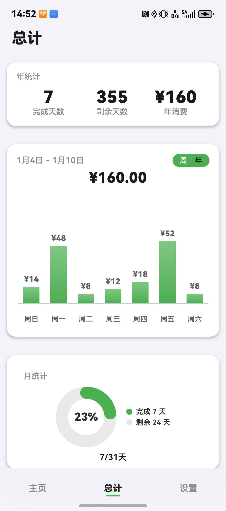
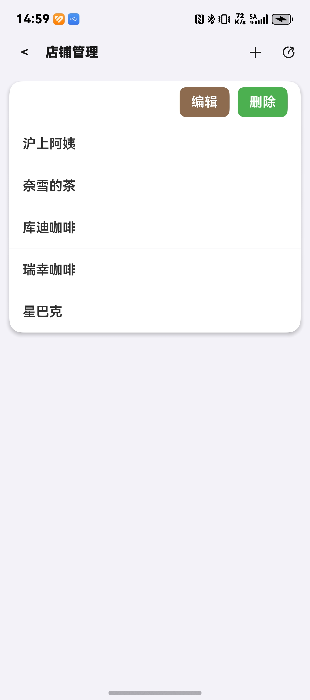
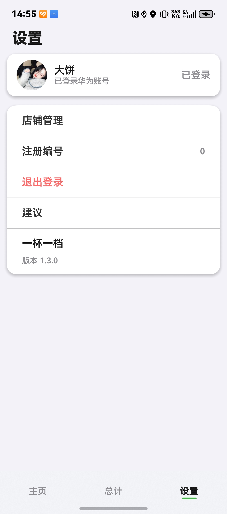

# 一杯一档

一杯一档是一款 HarmonyOS 饮品消费记录应用，用于记录饮品、店铺、热量、花费，并提供统计、历史记录、桌面卡片和账号登录相关能力。

> ## ⚠️ 免责声明
>
> **本项目示例代码中出现的店铺名称、饮品名称、价格、咖啡因含量等为虚构占位符（如"演示店铺 A""示例咖啡"），仅用于功能演示，不代表任何真实存在的商业品牌或产品。**
>
> 仓库中的演示截图来自开发者本机的真实使用记录，可能包含真实店铺名、饮品名、价格及个人账号信息，**仅作功能展示用途**，与任何商业品牌无合作关系。
>
> 📷 演示截图规范参见 [screenshots/README.md](./screenshots/README.md)

## 预览

| 统计页 | 店铺管理 | 设置与账号 |
| --- | --- | --- |
|  |  |  |

> ⚠️ 演示截图来自开发者本机的真实使用记录，店铺名、饮品名、价格与账号信息为真实数据，仅作功能展示用途。

## 功能特性

- **添加记录**：选择店铺、饮品、糖度，自动记录咖啡因与花费。
- **店铺管理**：自定义店铺与饮品（含咖啡因含量、单价、糖度）。
- **今日统计**：当日杯数 / 咖啡因 / 糖分累计。
- **日历视图**：年统计 + 月统计，标记每天是否有消费。
- **历史记录**：按时间倒序浏览所有记录，支持单条删除。
- **桌面卡片**：两张 2×4 / 2×2 服务卡片，桌面展示周金额与店铺榜单。
- **数据导入/导出**：以 JSON 格式分享或接收店铺与饮品数据。
- **多端适配**：手机、平板、2in1。

## 技术栈

- **HarmonyOS 6.0.0**（API Version 20）
- **DevEco Studio 6.0.0** 或以上
- **Stage 模式 + ArkTS**
- 主要 Kit/模块：
  - `@kit.ArkData` —— `relationalStore` 关系型数据库 / `preferences` 键值存储
  - `@kit.ArkUI` —— UI 框架、Canvas 图表绘制、组件截图
  - `@kit.FormKit` —— 桌面卡片 (`formProvider` / `formBindingData`)
  - `@kit.AccountKit` —— 华为账号登录（`authentication`）
  - `@kit.ShareKit` —— 系统分享 / 接收外部分享
  - `@kit.CloudFoundationKit` —— AGC 云函数调用（**需自建后端**）
  - `@kit.NetworkKit` / `@ohos.net.http` —— HTTP 请求
  - `@kit.CoreFileKit` / `@kit.ImageKit` —— 文件与图像处理
  - `@kit.PerformanceAnalysisKit` —— 日志（`hilog`）

## 代码架构

```
entry/src/main/ets/
├── entryability/         # 主 Ability 入口（加载主页、初始化数据库、监听分享拉起）
├── entrybackupability/   # 备份扩展 Ability
├── entryformability/     # 桌面卡片服务 Ability
├── pages/                # 页面
│   ├── Index.ets         # 三 Tab 主页壳（主页 / 总计 / 设置）
│   ├── Home.ets          # 主页（今日统计 + 店铺榜单 + 日历 + 最近记录）
│   ├── cacender.ets      # 统计页（日历 + 月/年统计图表）
│   ├── setting.ets       # 设置页（含华为账号登录入口）
│   ├── login.ets         # 早期独立登录页（保留参考，UI 入口在 setting）
│   ├── ShopManagePage.ets
│   └── AllRecordsPage.ets
├── model/                # 数据层
│   ├── *Record.ts        # 实体（CoffeeRecord / ShopRecord / ShopDrinkRecord）
│   ├── *Dao.ts           # 数据访问（增删改查）
│   ├── CoffeeDatabase.ts # 数据库初始化与迁移
│   ├── *Chart.ets        # 统计图表绘制（bar / line / yearlySpending）
│   ├── *Sheet.ets        # 弹窗（添加、编辑、添加店铺）
│   ├── ShopExportImportManager.ets  # 店铺数据导入导出
│   └── LoginStateManager.ets        # 登录状态管理
├── components/           # 复用组件
│   ├── HomeCard.ets      # 主页卡片（今日统计 / 店铺榜 / 最近记录）
│   ├── RankShareCard.ets / CalendarShareCard.ets  # 分享图卡片
│   └── SyncStatus.ets
├── utils/                # 工具
│   ├── HttpClient.ets    # HTTP 客户端（POST）
│   ├── AGCloudFunction.ets  # AGC 云函数调用封装
│   ├── ShareUtil.ets     # 截图分享
│   └── WindowUtil.ets
├── common/utils/
│   └── PreferencesUtil.ets  # Preferences 单例
├── widget1/pages/        # 桌面卡片 1：周金额统计
└── widget2/pages/        # 桌面卡片 2：店铺榜单
```

## 环境要求

- DevEco Studio 6.0.0 Release 或以上
- HarmonyOS 6.0.0 Release SDK / API Version 20 或以上

## 项目结构

```text
.
├── AppScope/              # 应用级配置和资源
├── entry/                 # HarmonyOS 主模块（主入口 + 桌面卡片）
├── hvigor/                # Hvigor 构建配置
├── screenshots/           # 演示截图（参见 screenshots/README.md）
├── OPEN_SOURCE_REMEDIATION.md  # 开源前整改说明
├── build-profile.json5
├── hvigorfile.ts
└── oh-package.json5
```

## 运行应用

1. 使用 DevEco Studio 打开本项目根目录。
2. 执行 Sync / Install 依赖。
3. 如需使用华为账号登录，请在 AppGallery Connect 创建自己的应用，并下载自己的 `agconnect-services.json` 到 `AppScope/rawfile/`。
4. 将 `entry/src/main/module.json5` 里的 `client_id` 改为自己在 AGC 创建应用后获得的值。
5. 运行 `entry` 模块。

> 仓库不包含签名证书、发布 profile、AGC 密钥、本地配置、数据库、依赖目录和构建产物。
>
> 仓库**不**包含登录相关的服务端示例代码（既不提供本地 Node 服务，也不提供 AGC 云函数）。如需自建后端，请自行实现并相应修改 `entry/src/main/ets/pages/login.ets` 里的 `clientId` 与 `serverUrl`、以及 `AGCloudFunction.ets` 里的 `CLOUD_FUNCTION_NAME`。

## 许可证

MIT License，详见 [LICENSE](./LICENSE)。

---

> ⚠️ 完整免责声明见上方"预览"章节。示例代码中的数据为虚构占位符；演示截图为开发者本机真实使用记录，仅作功能展示用途。
